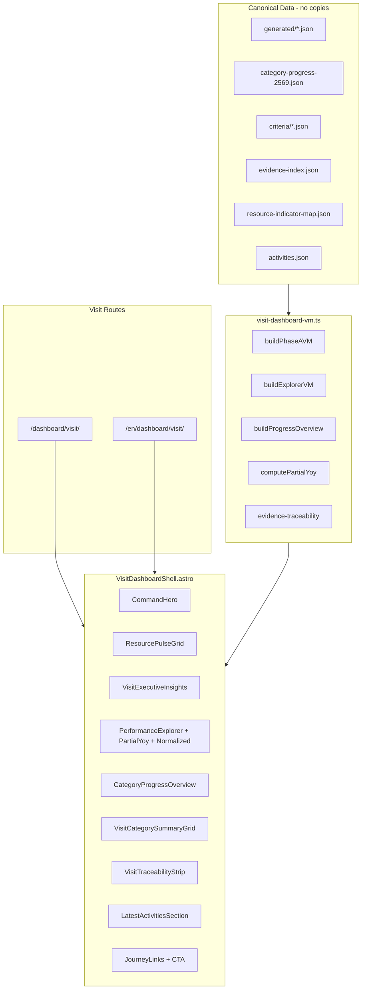

# VISIT DASHBOARD — IMPLEMENTATION PLAN

**Project:** Green Office 2026 — Executive Green Office Visit Dashboard  
**Document Type:** Audit + Implementation Blueprint (read-only phase complete)  
**Version:** 1.0  
**Status:** `PLAN_READY`  
**Date:** 2026-09-09  
**Repository:** [numtip/goffice2026](https://github.com/numtip/goffice2026)  
**Parent References:**
- `docs/00-GREENOFFICE_PROJECT_CONSTITUTION.MD`
- `docs/blueprint/GOFFICE2026_DASHBOARD_PROGRESS_BLUEPRINT_V1.md`

**Target routes (not yet implemented):**
- `/dashboard/visit/` (TH)
- `/en/dashboard/visit/` (EN)

---

## 0. Audit Preconditions

### Git / baseline verification (2026-09-09)

| Check | Result |
|-------|--------|
| `git fetch origin` | ✅ Completed |
| Working tree | ✅ Clean (`fix/dashboard-normalized-common-period`) |
| `origin/master` HEAD | ✅ `758c968` — `data(progress): sync Cat3 resource KPIs to published dashboard JSON (#89)` |
| Local `master` HEAD | ⚠️ `f9bce13` — **1 commit behind** `origin/master` |
| User-specified baseline `758c9682…` | ✅ Matches `origin/master` |

**Recommendation before implementation:** checkout `master`, fast-forward to `758c968`, branch from there. No merge/deploy in this audit phase.

### Stack

Astro static site (`output: 'static'`, `trailingSlash: 'always'`). No backend/API for MVP (Constitution §11–§14).

---

## 1. Goal

Deliver a **single-scroll executive visit dashboard** that tells the Green Office 2569 story for assessors and senior leadership in one sitting — reusing canonical data and existing dashboard/categories components, with no duplicate KPI/progress datasets and no invented official scores.

---

## 2. Section Map — Visit Page vs Existing Assets

| # | Visit section | Primary reuse | Gap / new work |
|---|---------------|---------------|----------------|
| 1 | Executive overview | `CommandHero.astro` + `buildPhaseAVM()` | Visit-specific kicker/title copy; optional condensed hero |
| 2 | 6 resource KPI cards | `ResourcePulseGrid.astro` + `ResourcePulseCard.astro` | None — direct reuse |
| 3 | Executive highlights / attention / next actions | Inline logic in `dashboard.astro` (lines ~104–144) + `category-progress-vm.ts` `needsAttention` | Extract to `VisitExecutiveInsights.astro` + shared VM; merge performance insights + criteria attention |
| 4 | Resource trends | `PerformanceExplorer.astro`, `PartialYoyExplorer.astro`, `NormalizedTrendChart.astro` | Condense layout for presentation; keep partial-year labels |
| 5 | Criteria progress (65 indicators) | `CategoryProgressOverview.astro` + `buildProgressOverview()` | Direct embed; already shows 65-indicator counts |
| 6 | 7 category summary | Category grid in `dashboard.astro` + stacked bar from `CategoryProgressOverview` | Add **actual progress counts** to category cards (today dashboard grid shows taxonomy only, no FY2569 counts) |
| 7 | Performance → action → indicator → evidence story | `resource-indicator-map.json`, `evidence-traceability.ts`, `JourneyLinks.astro` | **New** `VisitTraceabilityStrip.astro` — narrative chain linking 6 resources → indicators → evidence → action plan |
| 8 | Selected activities | `LatestActivitiesSection.astro` + `activities.json` | Reuse with visit heading; consider `relatedIndicators` filter for Green Office relevance |
| 9 | Summary / CTA | Closing banner in `dashboard.astro`, `JourneyLinks.astro` | Visit-specific CTA copy + deep links |
| + | Presentation / full-screen mode | None existing | **New** client script + CSS shell (`?present=1` or toggle); hide nav/footer, optional Fullscreen API |

---

## 3. Existing / Reuse / Missing / Conflict

### 3.1 Existing (ready to compose)

| Area | What exists |
|------|-------------|
| **Routes** | `/dashboard/`, `/dashboard/{energy\|water\|fuel\|paper\|waste\|ghg}/`, `/en/dashboard/…` — 14 routes |
| **Performance data** | `src/data/generated/{energy,water,fuel,paper,waste,ghg}.json` via `generatedMetricMap` |
| **KPI rollup** | `src/data/generated/kpi-summary.json` (metadata only — see Conflict) |
| **Progress data** | `src/data/progress/indicator-progress-2569.json` → `src/data/generated/category-progress-2569.json` |
| **Taxonomy** | `src/data/criteria/{categories,issues,indicators}.json` (7 / 24 / 65) |
| **Evidence** | `src/data/evidence-index.json` (134 items), `src/data/evidence-links.json` |
| **Performance↔indicator map** | `src/data/resource-indicator-map.json` |
| **View-models** | `dashboard-phase-a-vm.ts`, `dashboard-explorer-vm.ts`, `dashboard-normalized-vm.ts`, `dashboard-partial-yoy.ts`, `dashboard-executive.ts`, `category-progress-vm.ts` |
| **ECharts stack** | `EChart.astro`, `chart-option.ts`, `echarts-init.ts` |
| **Activities** | `src/data/content/activities.json` (25 published), `LatestActivitiesSection.astro` |
| **Guardrails** | `progress-model.ts`, `CommandHero` neverScoreNote, `test-fy2569-truthfulness.mjs` |
| **TH/EN routing** | `src/i18n/utils.ts` (`getLocale`, `getLocalizedPath`) |

### 3.2 Reuse (exact files — do not duplicate data)

#### Data (read-only imports)

```
src/data/dashboard-config.ts
src/data/generated/energy.json
src/data/generated/water.json
src/data/generated/fuel.json
src/data/generated/paper.json
src/data/generated/waste.json
src/data/generated/ghg.json
src/data/generated/category-progress-2569.json
src/data/progress/indicator-progress-2569.json
src/data/criteria/categories.json
src/data/criteria/issues.json
src/data/criteria/indicators.json
src/data/evidence-index.json
src/data/evidence-links.json
src/data/resource-indicator-map.json
src/data/content/activities.json
src/data/metric-theme.ts
```

#### Utilities

```
src/utils/dashboard-generated-metrics.ts      → generatedMetricMap
src/utils/dashboard-phase-a-vm.ts             → buildPhaseAVM(locale)
src/utils/dashboard-explorer-vm.ts            → buildExplorerVM(locale)
src/utils/dashboard-normalized-vm.ts          → buildNormalizedVM(locale)
src/utils/dashboard-partial-yoy.ts            → computePartialYoy (same-period YoY)
src/utils/dashboard-executive.ts              → generateExecutiveInsights (per-resource)
src/utils/category-progress-vm.ts             → buildProgressOverview(locale)
src/utils/evidence-traceability.ts            → getEvidenceForDashboard, getIndicatorCodesForDashboard
src/utils/content-presentation.ts             → getLatestPublished
src/utils/chart-option.ts                     → all ECharts builders
src/utils/data-status.ts                      → resolveDisplayStatus
src/i18n/utils.ts                             → getLocalizedPath, getLocale
src/i18n/dictionary.ts                        → getDictionary (extend visit keys)
```

#### Components (compose, do not fork logic)

```
src/components/dashboard/CommandHero.astro
src/components/dashboard/ResourcePulseGrid.astro
src/components/dashboard/ResourcePulseCard.astro
src/components/dashboard/PerformanceExplorer.astro
src/components/dashboard/PartialYoyExplorer.astro
src/components/dashboard/NormalizedTrendChart.astro
src/components/dashboard/DataReadinessMatrix.astro
src/components/dashboard/EChart.astro
src/components/dashboard/ChartLegend.astro
src/components/categories/CategoryProgressOverview.astro
src/components/landing/LatestActivitiesSection.astro
src/components/content/ContentCard.astro
src/components/ui/JourneyLinks.astro
src/layouts/BaseLayout.astro
```

### 3.3 Missing (must add)

| Item | Purpose |
|------|---------|
| Visit page routes | `src/pages/dashboard/visit/index.astro`, `src/pages/en/dashboard/visit/index.astro` |
| Visit shell component | Single shared layout composing sections 1–9 |
| `visit-dashboard-vm.ts` | Orchestration VM — one import surface for visit page |
| `VisitExecutiveInsights.astro` | Unified improving / attention / partial-year / criteria needs-attention |
| `VisitTraceabilityStrip.astro` | Performance → indicator → evidence → action plan narrative |
| `VisitCategorySummaryGrid.astro` | 7 cards with **progress counts** from `category-progress-2569.json` |
| `visit-presentation.ts` + CSS | Presentation mode (hide chrome, section focus, optional fullscreen) |
| Locale strings | `visitDashboard` section in `src/data/locales/{th,en}.json` |
| Acceptance tests | Extend `test-fy2569-truthfulness.mjs` or add `test-visit-dashboard.mjs` |
| Navigation entry (optional) | Link from dashboard overview — defer to Phase 2 if PO prefers quiet launch |

### 3.4 Conflicts / guardrails

| Conflict | Mitigation |
|----------|------------|
| **`kpi-summary.json` `yoyChange`** uses full-year comparison | Visit insights **must** use `computePartialYoy()` only (same as `dashboard.astro` lines 116–118) |
| **Dashboard category grid** shows taxonomy, not FY2569 progress | Visit section 6 must pull counts from `buildProgressOverview()` — not copy dashboard grid blindly |
| **TH/EN duplication** — `dashboard.astro` vs `en/dashboard/index.astro` (~500 lines each) | Visit **must** use one shell + `locale` prop (pattern: `MetricDashboard.astro`) |
| **Progress ≠ Evidence ≠ Performance ≠ Official Score** | Separate visual blocks with existing disclaimer copy; never merge into one “score” |
| **Partial-year data** (typically 8/12 months FY2569) | Label every YoY/total as same-period or partial; show `monthsCount/12`; never imply full-year |
| **No auto-generated official Green Office scores** | Reuse `neverScoreNote`, “Awaiting official assessment”, `progress-model.ts` guardrails |
| **Activities EN translation** | Most records TH-only; EN visit page shows honest “translation pending” where applicable |
| **Local master behind origin** | Branch from `origin/master` @ `758c968`, not stale local master |

---

## 4. Semantic Separation (non-negotiable)

```
┌─────────────────────┬──────────────────────────────────────────────────────────┐
│ Track               │ Visit dashboard treatment                                │
├─────────────────────┼──────────────────────────────────────────────────────────┤
│ PERFORMANCE         │ Sections 2, 4 — resource KPIs, monthly trends, partial   │
│ (ผลการดำเนินงาน)    │ YoY from generated/*.json                                │
├─────────────────────┼──────────────────────────────────────────────────────────┤
│ PROGRESS            │ Sections 5, 6 — 65 indicators, 7 categories from         │
│ (ความคืบหน้า)       │ category-progress-2569.json via category-progress-vm     │
├─────────────────────┼──────────────────────────────────────────────────────────┤
│ EVIDENCE READINESS  │ Section 7 + hero evidence count — evidence-index.json;   │
│ (ความพร้อมหลักฐาน)  │ separate badge/block from progress counts                │
├─────────────────────┼──────────────────────────────────────────────────────────┤
│ OFFICIAL SCORE      │ **Never displayed** — disclaimer in sections 1, 5, 6, 9  │
│ (คะแนนประเมิน 0–4)  │                                                          │
└─────────────────────┴──────────────────────────────────────────────────────────┘
```

---

## 5. Proposed Architecture



### Presentation mode (feasible, Phase 3)

- URL flag: `/dashboard/visit/?present=1`
- CSS: `.visit-present` on `<html>` hides `Navigation`, footer, journey links; increases chart/card scale
- Client: optional `requestFullscreen()` toggle button (respects `prefers-reduced-motion`)
- No new backend; static Astro page + small client script

---

## 6. Minimal Files to Add / Change

### Add (estimated 8–10 files)

| File | Lines (est.) | Role |
|------|-------------|------|
| `src/pages/dashboard/visit/index.astro` | ~30 | TH route — imports shell, sets locale |
| `src/pages/en/dashboard/visit/index.astro` | ~30 | EN route |
| `src/components/dashboard/visit/VisitDashboardShell.astro` | ~200 | Composes all 9 sections |
| `src/utils/visit-dashboard-vm.ts` | ~120 | Single orchestration VM |
| `src/components/dashboard/visit/VisitExecutiveInsights.astro` | ~150 | Extracted insights panel |
| `src/components/dashboard/visit/VisitTraceabilityStrip.astro` | ~100 | Performance→evidence story |
| `src/components/dashboard/visit/VisitCategorySummaryGrid.astro` | ~80 | 7 categories with progress counts |
| `src/scripts/visit-presentation.ts` | ~60 | Presentation mode toggle |
| `scripts/test-visit-dashboard.mjs` | ~80 | Route + truthfulness regression |
| `docs/blueprint/VISIT_DASHBOARD_IMPLEMENTATION_PLAN.md` | — | This document |

### Change (minimal)

| File | Change |
|------|--------|
| `src/data/locales/th.json` | Add `visitDashboard` string block |
| `src/data/locales/en.json` | Add `visitDashboard` string block |
| `src/styles/global.css` | Add `.visit-present` utilities (~30 lines) |
| `src/pages/dashboard.astro` | Optional: link to visit dashboard (Phase 2) |
| `src/components/ui/Navigation.astro` | Optional: visit link under Dashboard (Phase 2) |

**Do NOT add:** new JSON datasets, duplicate KPI files, backend endpoints, or score fields.

---

## 7. Implementation Phases

### Phase 0 — Branch setup (pre-work)
- Fast-forward local `master` to `origin/master` (`758c968`)
- Create branch `feat/dashboard-visit-executive`
- Confirm `npm run build` passes on baseline

### Phase 1 — Shell + sections 1–2–9 (MVP skeleton)
- Add TH/EN routes
- `VisitDashboardShell` with `CommandHero`, `ResourcePulseGrid`, closing CTA
- Locale strings; build passes; routes appear in sitemap

### Phase 2 — Performance narrative (sections 3–4)
- `VisitExecutiveInsights` using `computePartialYoy` + `needsAttention`
- Embed `PerformanceExplorer`, `PartialYoyExplorer`, `NormalizedTrendChart`
- Partial-year disclaimers on every YoY figure

### Phase 3 — Criteria narrative (sections 5–6)
- Embed `CategoryProgressOverview` (65 indicators)
- `VisitCategorySummaryGrid` with per-category ready/in-progress/unavailable counts
- Official-score disclaimers

### Phase 4 — Story chain + activities (sections 7–8)
- `VisitTraceabilityStrip`: 6 resources → mapped indicators → linked evidence → `/about/action-plan/`
- `LatestActivitiesSection` (3–6 curated or latest published)

### Phase 5 — Presentation mode + polish
- `visit-presentation.ts`, CSS, keyboard-friendly section anchors
- Optional nav link from main dashboard
- Runtime QA on projector/tablet

### Phase 6 — Tests + docs
- `test-visit-dashboard.mjs` + extend truthfulness suite
- Update `GOFFICE2026_DASHBOARD_PROGRESS_BLUEPRINT_V1.md` cross-reference (one paragraph)

---

## 8. Risks

| Risk | Likelihood | Impact | Mitigation |
|------|------------|--------|------------|
| Accidental full-year YoY display | Medium | High — false “improvement” narrative | Mandate `computePartialYoy`; ban `kpi-summary.yoyChange` in visit VM |
| Progress/score conflation | Medium | High — assessor mistrust | Separate sections + copy review against `test-fy2569-truthfulness.mjs` |
| Page length / load on visit day | Medium | Medium | Lazy-load charts below fold; presentation mode hides non-essential chrome |
| TH/EN string drift | Low | Medium | Single shell + dictionary keys (avoid dashboard.astro duplication) |
| Activities mostly TH-only | High | Low | Honest EN fallback; filter to published-with-summaryEn where available |
| ECharts resize in fullscreen | Low | Medium | Reuse `echarts-init.ts` ResizeObserver; trigger on presentation toggle |
| Stale branch baseline | Confirmed | Medium | Branch from `758c968`, not local `f9bce13` |

---

## 9. Acceptance Tests

### Automated (`scripts/test-visit-dashboard.mjs`)

1. **Routes exist** — built HTML contains `/dashboard/visit/index.html` and `/en/dashboard/visit/index.html`
2. **No official score language** — page HTML must not match `/\b(score|คะแนน)\s*(of|ประเมิน)?\s*[0-4]/i` in score context (extend truthfulness patterns)
3. **Partial-year labels present** — page contains “same-period” / “ช่วงเวลาเดียวกัน” when YoY shown
4. **Progress data sourced correctly** — rendered category counts match `category-progress-2569.json` overall.ready (5) and total (65)
5. **No duplicate dataset files** — glob `src/data/**/visit*.json` returns zero
6. **Semantic blocks present** — HTML contains distinct section headings for Performance, Progress, Evidence (not merged)
7. **Presentation mode** — `?present=1` adds `visit-present` class (client script unit or built HTML attribute check)

### Manual runtime QA (required before release — Constitution §10)

- [ ] Open `/dashboard/visit/` on 1920×1080 projector — readable without scrolling zoom
- [ ] Toggle presentation mode — nav/footer hidden, charts resize
- [ ] Verify each of 6 resource cards links to correct `/dashboard/{id}/`
- [ ] Verify partial-year badge shows correct month count (e.g. 8/12)
- [ ] Verify category progress numbers match `/categories/` overview
- [ ] Verify traceability strip links resolve (indicators, evidence, action plan)
- [ ] EN page: all disclaimers present, no untranslated score language
- [ ] `npm run build` PASS + spot-check dist output

### Regression

- Extend `scripts/test-fy2569-truthfulness.mjs` with visit route forbidden phrases
- Existing dashboard routes unchanged (no regression on `/dashboard/`)

---

## 10. Recommended Branch Name

```
feat/dashboard-visit-executive
```

Alternates: `feat/visit-dashboard-executive`, `feat/go-dash-visit-v1`

---

## 11. Current Dashboard Section Inventory (reference)

Existing `/dashboard/` executive overview (`src/pages/dashboard.astro`) already implements:

1. CommandHero (coverage + evidence count + taxonomy)
2. ResourcePulseGrid (6 KPI cards)
3. PerformanceExplorer (6 small-multiple line charts)
4. PartialYoyExplorer (tabbed same-period YoY)
5. Executive Insights 2×2 (improving / attention / partial-year / highest risk)
6. NormalizedTrendChart (baseline index)
7. Green Office Category Framework grid (**taxonomy only — no progress counts**)
8. DataReadinessMatrix
9. Trust & Evidence panel + closing banner
10. JourneyLinks

**Visit dashboard delta:** add criteria progress (sections 5–6 from plan), traceability story, activities, presentation mode; tighten narrative for assessor visit; fix category grid to show real progress.

---

## 12. Status

| Milestone | State |
|-----------|-------|
| Repo audit | ✅ Complete |
| Data/component inventory | ✅ Complete |
| Conflict analysis | ✅ Complete |
| Implementation plan document | ✅ This file |
| Code implementation | ⏸ Not started |
| Merge / deploy | ⏸ Not started |

**`PLAN_READY`** — awaiting Product Owner approval to begin Phase 0.

---

*Audit performed read-only. Subagent reports: dashboard routes/components, categories/progress data, activities/constitution. No destructive commands executed.*
